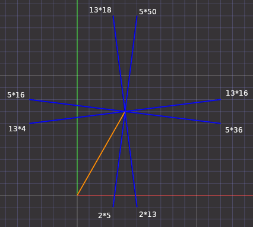

# Factoring semiprime given one sum of two squares representation

## Challenge and price money

```
pi@raspberrypi5:~/RSA_numbers_factored/1_sum_of_2_sqs_semiprime $ gp -q
? x=4675966568241743081873479921415404781226665419569548210315782648657034701192057386949090276633929520980704940531187630512099300307;
? y=15512340356624619735725710103759797813121190798562361321728468720849205060936899989010233224533248153329173333001037083787589728422;
? n=262497366687079298365523922947227261835640624571224693166902778465021817904092516082216927109476590103573107044406347695971527079161864485154522005142837118124732638711372016122621735436807398062028290119971297328351792353815685809546983240652624562758684904333;
? n==x^2+y^2
1
? 
```
Determine prime factorization of 261 decimal digits semiprime <kbd>n = p * q</kbd>, knowing one sum of two squares representation.

Send prime factorization as well as method used to <a href="mailto:challenge@stamm-wilbrandt.de">challenge@stamm-wilbrandt.de</a>.

The first correct submission will receive 100 USD price money.  
Preferable let me know to which paypal account I should transfer the price money to.

These two threads suggest that knowing one sum of two squares representation of semiprime does not help in factoring:  
- https://math.stackexchange.com/questions/4655361/eulers-factorization-needs-two-different-sums-of-squares-what-if-only-one-sum
- https://math.stackexchange.com/questions/2294749/finding-other-representations-for-a-sum-of-two-squares

This challenge is to give a little incentive to find a method if it exists.  
The biggest number factored sofar was RSA-250, and the factorization did need 2700 CPU core years.  
This challenge number has 261 decimal digits to make sure no factoring method like cado-nfs can help.

Only if both factors of a semiprime are "=1 (mod 4)", the semiprime has two sum of two squares representations. Knowing both Euler factorization easily factors the semiprime. Biggest such factored sofar RSA number is RSA-768, as demonstration:
```
hermann@j4105:~/RSA_numbers_factored/pari$ gp -q RSA_numbers_factored.gp
? [,n]=RSA.get(768);
? [e,f]=RSA.square_sums(768);[a,b]=e;[c,d]=f;
? #digits(n)
232
? a^2+b^2==n && c^2+d^2==n && #Set([a,b,c,d])==4
1
? #digits(gcd(n,(a+c)^2+(b+d)^2))
116
?
```

For semiprime 65=5\*13, gaussian integers are a=4+7\*I and b=8+1\*I. From b get another summand to a with conj(b), get another two by -x and another 4 by conj(-I\*conj(x)). Here the 8 resulting additions are shown with their norml2() values, indicating the prime that will result when applying gcd() with n:  


## Related forum and mailing list threads

- mersenneforum.org > Math Stuff > Computer Science & Computational Number Theory  
  https://www.mersenneforum.org/node/1058748
- pari-users mailing list  
  https://pari.math.u-bordeaux.fr/archives/pari-users-2411/msg00002.html


## Challenge creation

Python script [challenge.py](challenge.py) uses seconds since 1st January 1970 for random generator seed generation (epoch time). 

To make it impossible for me to know which seed was used, <kbd>time.time_ns()</kbd> determines at nanosecond resolution.

To make it impossible for you to know the seed, I did input an additional factor that is used in determining the seed used.

Next two roughly 130 decimal digits random numbers are created.

Finally PARI/GP script [challenge.gp](challenge.gp) is executed for that pair of random numbers.


The PARI/GP script first determines the next primes <kbd>=1 (mod 4)</kbd> for the two numbers, and defines <kbd>n</kbd> as their product.

The first <kbd>1</kbd> in output verifies that the two sum of two squares determined initially sum up to the prime factors <kbd>p</kbd> and <kbd>q</kbd> of semiprime <kbd>n</kbd>.

The second <kbd>1</kbd> verfies that both computed sum of two squares sum up to <kbd>n</kbd> and that both sum of two squares are different.

Finally <kbd>x, y, n</kbd> are printed with <kbd>n == x^2 + y^2<kbd>.

```
pi@raspberrypi5:~/RSA_numbers_factored/1_sum_of_2_sqs_semiprime $ ./challenge.py
factor: ****************************************************
1
1
4675966568241743081873479921415404781226665419569548210315782648657034701192057386949090276633929520980704940531187630512099300307
15512340356624619735725710103759797813121190798562361321728468720849205060936899989010233224533248153329173333001037083787589728422
262497366687079298365523922947227261835640624571224693166902778465021817904092516082216927109476590103573107044406347695971527079161864485154522005142837118124732638711372016122621735436807398062028290119971297328351792353815685809546983240652624562758684904333
261 decimal digits semiprime
pi@raspberrypi5:~/RSA_numbers_factored/1_sum_of_2_sqs_semiprime $ 
```

### Challenge creation with PARI/GP only

I learned on pari-users mailing list how to do secret input with PARI/GP input() and system("stty -echo"). Additional script [challenge2.gp](challenge2.gp) does the same as the other scripts, but completely in PARI/GP. The string of asterisks appears only after input has completed, and epoch time resolution is milliseconds instead of nanoseconds with Python. Just do  
```
gp -q challenge2.gp
```
and then input a factor.
