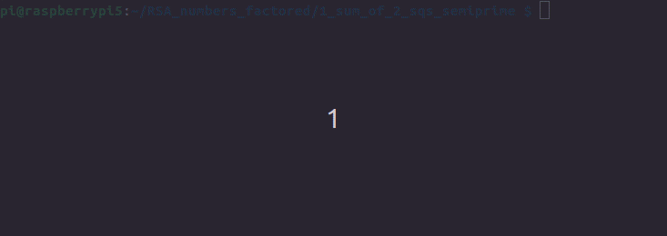

# Factoring semiprime given one sum of two squares representation

## Challenge and price money

```
pi@raspberrypi5:~/RSA_numbers_factored/1_sum_of_2_sqs_semiprime $ gp -q
? x=4675966568241743081873479921415404781226665419569548210315782648657034701192057386949090276633929520980704940531187630512099300307;
? y=15512340356624619735725710103759797813121190798562361321728468720849205060936899989010233224533248153329173333001037083787589728422;
? n=262497366687079298365523922947227261835640624571224693166902778465021817904092516082216927109476590103573107044406347695971527079161864485154522005142837118124732638711372016122621735436807398062028290119971297328351792353815685809546983240652624562758684904333;
? n==x^2+y^2
1
? 
```
Determine prime factorization of 261 decimal digits semiprime <kbd>n = p * q</kbd>, knowing one sum of two squares representation.

Send prime factorization as well as method used to <a href="mailto:challenge@stamm-wilbrandt.de">challenge@stamm-wilbrandt.de</a>.

The first correct submission will receive 100 USD price money.  
Preferable let me know to which paypal account I should transfer the price money to.

These two threads suggest that knowing one sum of two squares representation of semiprime does not help in factoring (the first posting demonstrates how easy prime factorization is if both sum of two squares for a semiprime are known):  
- https://math.stackexchange.com/questions/4655361/eulers-factorization-needs-two-different-sums-of-squares-what-if-only-one-sum
- https://math.stackexchange.com/questions/2294749/finding-other-representations-for-a-sum-of-two-squares

This challenge is to give a little incentive to find a method if it exists.  
The biggest number factored sofar was RSA-250, and the factorization did need 2700 CPU core years.  
This challenge number has 261 decimal digits to make sure no factoring method like cado-nfs can help.

## Related forum and mailing list threads

- 

## Challenge creation

Python script [challenge.py](challenge.py) uses seconds since 1st January 1970 for random generator seed generation (epoch time). 

To make it impossible for me to know which seed was used, <kbd>time.time_ns()</kbd> determines at nanosecond resolution.

To make it impossible for you to know the seed, I did input an additional factor that is used in determining the seed used.

Next two roughly 130 decimal digits random numbers are created.

Finally PARI/GP script [challenge.gp](challenge.gp) is executed for that pair of random numbers.



The PARI/GP script first determines the next primes <kbd>=1 (mod 4)</kbd> for the two numbers, and defines <kbd>n</kbd> as their product.

The first <kbd>1</kbd> in output verifies that the two sum of two squares determined initially sum up to the prime factors <kbd>p</kbd> and <kbd>q</kbd> of semiprime <kbd>n</kbd>.

The second <kbd>1</kbd> verfies that both computed sum of two squares sum up to <kbd>n</kbd> and that both sum of two squares are different.

Finally <kbd>x, y, n</kbd> are printed with <kbd>n == x^2 + y^2<kbd>.

```
pi@raspberrypi5:~/RSA_numbers_factored/1_sum_of_2_sqs_semiprime $ ./challenge.py
factor: ****************************************************
1
1
4675966568241743081873479921415404781226665419569548210315782648657034701192057386949090276633929520980704940531187630512099300307
15512340356624619735725710103759797813121190798562361321728468720849205060936899989010233224533248153329173333001037083787589728422
262497366687079298365523922947227261835640624571224693166902778465021817904092516082216927109476590103573107044406347695971527079161864485154522005142837118124732638711372016122621735436807398062028290119971297328351792353815685809546983240652624562758684904333
261 decimal digits semiprime
pi@raspberrypi5:~/RSA_numbers_factored/1_sum_of_2_sqs_semiprime $ 
```

