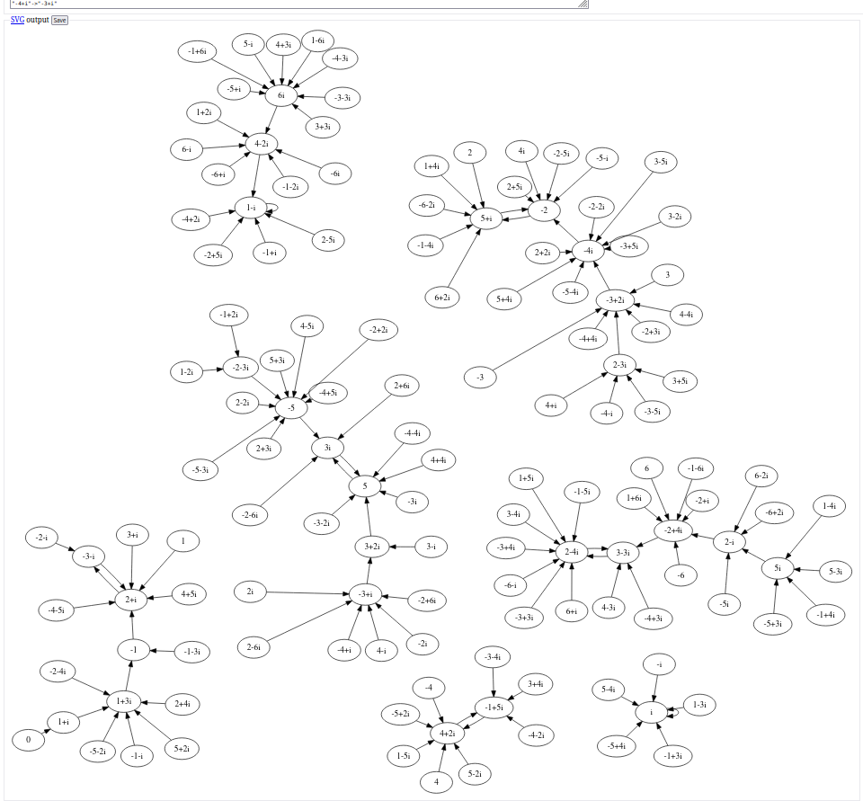

Knowing one sum of two squares $x^2+y^2$ of semiprime $n=pq$ with primes $p,q=1 (mod 4)$ allows for division
with remainder in $\mathbb{Z}[i]$ wrt. $x+yi$, which I wanted to use for Pollard-Rho algorithm instead of "modulo $n$".

In PARI/GP $round()$ can be applied to complex numbers, and rounds to nearest gaussian integer.

$norml2()$ returns the square of $L_2$ norm for complex numbers.

So this implementation returns minimal $norml2()$ representant $r$, with $norml2(r)\leq n/2$.
```
gimod(ded,nom)=den-round(den/nom)*nom;
```

Since the factors need to be from $\mathbb{Z}[i]$ which is a ring but not a field, $\mathbb{Z}[i]$ over itself 
is not a vector space, but a module. 
$<x+yi>$ is a pricipal ideal in $\mathbb{Z}[i]$ and factor module $\mathbb{Z}[i]/<x+yi>$ is isomorphic to $\mathbb{Z}_n$.

In PARI/GP $lift(Mod(x,n)/y)$ computes a $sqrt(-1)$ modulo $n$. Replacing $i$ with that value is an isomorphism
between $\mathbb{Z}[i]/<x+yi>$ and $\mathbb{Z}_n$.

For example $n=85=5\cdot 17$ and $7+6i$ with $norml2(7+6i)=85$ results in $sqrt(-1)$ modulo $85$ of:
```
? lift(Mod(7,85)/6)
72
? (lift(Mod(7,85)/6))^2==Mod(-1,85)
1
? 
```
Replacing $i$ in eg. $x\mapsto x^2+1+i$ function over $\mathbb{Z}[i]/<7+4i>$ of Pollard Rho algorithm
has isomorphic $x\mapsto x^2+73$ over $\mathbb{Z}_{85}$.
So nothing new is gained by Pollard-Rho on factor module instead of "modulo $n$".

So the graph obtained by [gi_polrho.cpp](gi_polrho.cpp)
```
$ f=gi_polrho
$ g++ -std=c++23 -Wall -Wextra -pedantic $f.cpp -o $f
$ ./$f 7 6 > 7_6.dot
$
```
[looks nice](https://stamm-wilbrandt.de/GraphvizFiddle/2.1.2/?1784463208166#digraph%20G%20%7B%0Alayout%3Dneato%0Aoverlap%20%3D%20%22false%22%0Asep%20%3D%20%22%2B0.1%22%0A%22-6-2i%22-%3E%225%2Bi%22%0A%22-6-i%22-%3E%222-4i%22%0A%22-6%22-%3E%22-2%2B4i%22%0A%22-6%2Bi%22-%3E%224-2i%22%0A%22-6%2B2i%22-%3E%222-i%22%0A%22-5-4i%22-%3E%22-4i%22%0A%22-5-3i%22-%3E%22-5%22%0A%22-5-2i%22-%3E%221%2B3i%22%0A%22-5-i%22-%3E%22-2%22%0A%22-5%22-%3E%223i%22%0A%22-5%2Bi%22-%3E%226i%22%0A%22-5%2B2i%22-%3E%224%2B2i%22%0A%22-5%2B3i%22-%3E%225i%22%0A%22-5%2B4i%22-%3E%22i%22%0A%22-4-5i%22-%3E%222%2Bi%22%0A%22-4-4i%22-%3E%225%22%0A%22-4-3i%22-%3E%226i%22%0A%22-4-2i%22-%3E%22-1%2B5i%22%0A%22-4-i%22-%3E%222-3i%22%0A%22-4%22-%3E%224%2B2i%22%0A%22-4%2Bi%22-%3E%22-3%2Bi%22%0A%22-4%2B2i%22-%3E%221-i%22%0A%22-4%2B3i%22-%3E%223-3i%22%0A%22-4%2B4i%22-%3E%22-3%2B2i%22%0A%22-4%2B5i%22-%3E%22-5%22%0A%22-3-5i%22-%3E%222-3i%22%0A%22-3-4i%22-%3E%22-1%2B5i%22%0A%22-3-3i%22-%3E%226i%22%0A%22-3-2i%22-%3E%225%22%0A%22-3-i%22-%3E%222%2Bi%22%0A%22-3%22-%3E%22-3%2B2i%22%0A%22-3%2Bi%22-%3E%223%2B2i%22%0A%22-3%2B2i%22-%3E%22-4i%22%0A%22-3%2B3i%22-%3E%222-4i%22%0A%22-3%2B4i%22-%3E%222-4i%22%0A%22-3%2B5i%22-%3E%22-4i%22%0A%22-2-6i%22-%3E%223i%22%0A%22-2-5i%22-%3E%22-2%22%0A%22-2-4i%22-%3E%221%2B3i%22%0A%22-2-3i%22-%3E%22-5%22%0A%22-2-2i%22-%3E%22-4i%22%0A%22-2-i%22-%3E%22-3-i%22%0A%22-2%22-%3E%225%2Bi%22%0A%22-2%2Bi%22-%3E%22-2%2B4i%22%0A%22-2%2B2i%22-%3E%22-5%22%0A%22-2%2B3i%22-%3E%22-3%2B2i%22%0A%22-2%2B4i%22-%3E%223-3i%22%0A%22-2%2B5i%22-%3E%221-i%22%0A%22-2%2B6i%22-%3E%22-3%2Bi%22%0A%22-1-6i%22-%3E%22-2%2B4i%22%0A%22-1-5i%22-%3E%222-4i%22%0A%22-1-4i%22-%3E%225%2Bi%22%0A%22-1-3i%22-%3E%22-1%22%0A%22-1-2i%22-%3E%224-2i%22%0A%22-1-i%22-%3E%221%2B3i%22%0A%22-1%22-%3E%222%2Bi%22%0A%22-1%2Bi%22-%3E%221-i%22%0A%22-1%2B2i%22-%3E%22-2-3i%22%0A%22-1%2B3i%22-%3E%22i%22%0A%22-1%2B4i%22-%3E%225i%22%0A%22-1%2B5i%22-%3E%224%2B2i%22%0A%22-1%2B6i%22-%3E%226i%22%0A%22-6i%22-%3E%224-2i%22%0A%22-5i%22-%3E%222-i%22%0A%22-4i%22-%3E%22-2%22%0A%22-3i%22-%3E%225%22%0A%22-2i%22-%3E%22-3%2Bi%22%0A%22-i%22-%3E%22i%22%0A%220%22-%3E%221%2Bi%22%0A%22i%22-%3E%22i%22%0A%222i%22-%3E%22-3%2Bi%22%0A%223i%22-%3E%225%22%0A%224i%22-%3E%22-2%22%0A%225i%22-%3E%222-i%22%0A%226i%22-%3E%224-2i%22%0A%221-6i%22-%3E%226i%22%0A%221-5i%22-%3E%224%2B2i%22%0A%221-4i%22-%3E%225i%22%0A%221-3i%22-%3E%22i%22%0A%221-2i%22-%3E%22-2-3i%22%0A%221-i%22-%3E%221-i%22%0A%221%22-%3E%222%2Bi%22%0A%221%2Bi%22-%3E%221%2B3i%22%0A%221%2B2i%22-%3E%224-2i%22%0A%221%2B3i%22-%3E%22-1%22%0A%221%2B4i%22-%3E%225%2Bi%22%0A%221%2B5i%22-%3E%222-4i%22%0A%221%2B6i%22-%3E%22-2%2B4i%22%0A%222-6i%22-%3E%22-3%2Bi%22%0A%222-5i%22-%3E%221-i%22%0A%222-4i%22-%3E%223-3i%22%0A%222-3i%22-%3E%22-3%2B2i%22%0A%222-2i%22-%3E%22-5%22%0A%222-i%22-%3E%22-2%2B4i%22%0A%222%22-%3E%225%2Bi%22%0A%222%2Bi%22-%3E%22-3-i%22%0A%222%2B2i%22-%3E%22-4i%22%0A%222%2B3i%22-%3E%22-5%22%0A%222%2B4i%22-%3E%221%2B3i%22%0A%222%2B5i%22-%3E%22-2%22%0A%222%2B6i%22-%3E%223i%22%0A%223-5i%22-%3E%22-4i%22%0A%223-4i%22-%3E%222-4i%22%0A%223-3i%22-%3E%222-4i%22%0A%223-2i%22-%3E%22-4i%22%0A%223-i%22-%3E%223%2B2i%22%0A%223%22-%3E%22-3%2B2i%22%0A%223%2Bi%22-%3E%222%2Bi%22%0A%223%2B2i%22-%3E%225%22%0A%223%2B3i%22-%3E%226i%22%0A%223%2B4i%22-%3E%22-1%2B5i%22%0A%223%2B5i%22-%3E%222-3i%22%0A%224-5i%22-%3E%22-5%22%0A%224-4i%22-%3E%22-3%2B2i%22%0A%224-3i%22-%3E%223-3i%22%0A%224-2i%22-%3E%221-i%22%0A%224-i%22-%3E%22-3%2Bi%22%0A%224%22-%3E%224%2B2i%22%0A%224%2Bi%22-%3E%222-3i%22%0A%224%2B2i%22-%3E%22-1%2B5i%22%0A%224%2B3i%22-%3E%226i%22%0A%224%2B4i%22-%3E%225%22%0A%224%2B5i%22-%3E%222%2Bi%22%0A%225-4i%22-%3E%22i%22%0A%225-3i%22-%3E%225i%22%0A%225-2i%22-%3E%224%2B2i%22%0A%225-i%22-%3E%226i%22%0A%225%22-%3E%223i%22%0A%225%2Bi%22-%3E%22-2%22%0A%225%2B2i%22-%3E%221%2B3i%22%0A%225%2B3i%22-%3E%22-5%22%0A%225%2B4i%22-%3E%22-4i%22%0A%226-2i%22-%3E%222-i%22%0A%226-i%22-%3E%224-2i%22%0A%226%22-%3E%22-2%2B4i%22%0A%226%2Bi%22-%3E%222-4i%22%0A%226%2B2i%22-%3E%225%2Bi%22%0A%7D)
(scaled to 50% size below), but is the same Pollard-Rho graph with labels $0..84$ and "modulo $85$".

The non-self loops loops can be identified with
GraphViz tool ```sccmap```:
```
$ sccmap -v 7_6.dot 
digraph cluster_0 {
	graph [layout=neato,
		overlap=false,
		sep="+0.1"
	];
	"5+i" -> -2;
	-2 -> "5+i";
}
digraph cluster_1 {
	graph [layout=neato,
		overlap=false,
		sep="+0.1"
	];
	"2-4i" -> "3-3i";
	"3-3i" -> "2-4i";
}
digraph cluster_2 {
	graph [layout=neato,
		overlap=false,
		sep="+0.1"
	];
	"3i" -> 5;
	5 -> "3i";
}
digraph cluster_3 {
	graph [layout=neato,
		overlap=false,
		sep="+0.1"
	];
	"2+i" -> "-3-i";
	"-3-i" -> "2+i";
}
digraph cluster_4 {
	graph [layout=neato,
		overlap=false,
		sep="+0.1"
	];
	"4+2i" -> "-1+5i";
	"-1+5i" -> "4+2i";
}
digraph scc_map {
	cluster_0;
	cluster_1;
	cluster_2;
	cluster_3;
	cluster_4;
}
137 137 8 5 0.0730 9 0.5204
$
```


