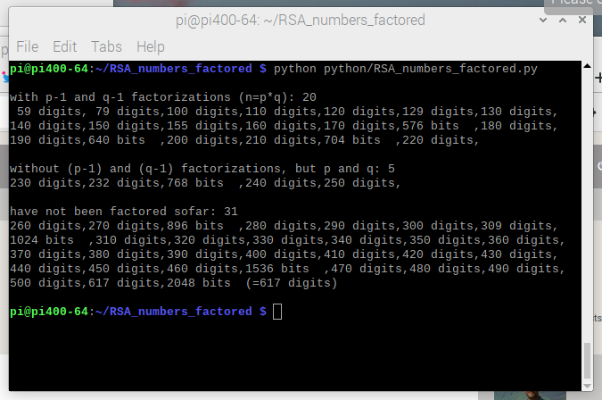
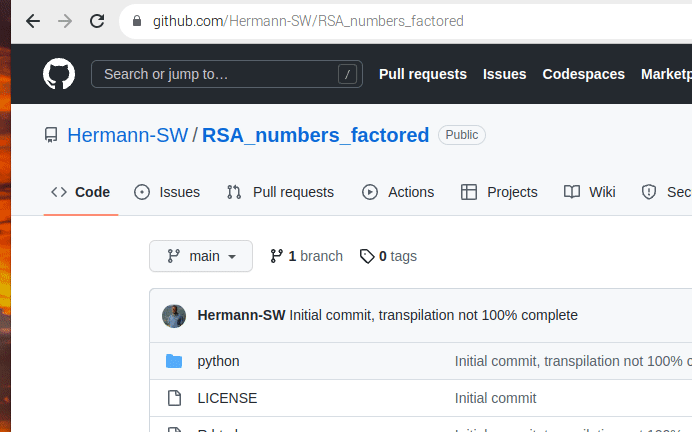
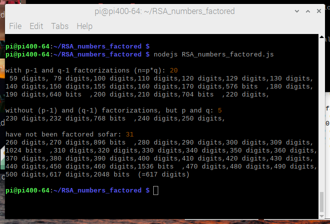
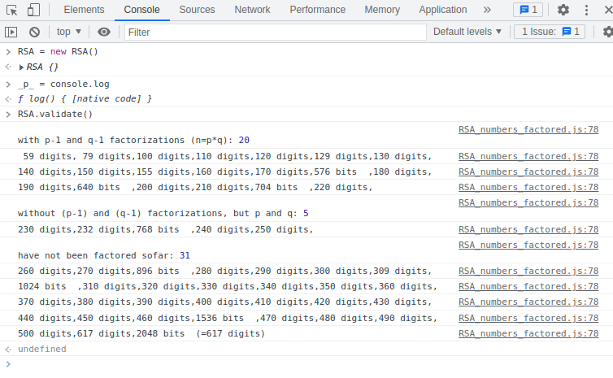

# RSA_numbers_factored

Related forum thread:  
[https://forums.raspberrypi.com/viewtopic.php?t=343468](https://forums.raspberrypi.com/viewtopic.php?t=343468)

Continuation of [RSA_numbers_factored.py gist](https://gist.github.com/Hermann-SW/839dfe6002810d404e3f0fe1808a6333) (now in [python/RSA_numbers_factored.py](python/RSA_numbers_factored.py) and documented [here](python/docs/RSA_numbers_factored.py.md)), with transpiled [RSA_numbers_factored.js](RSA_numbers_factored.js) (from the Python version) and HTML demos.

Version with  emulation of used sympy functionality [python/RSA_numbers_factored_mp.py](python/RSA_numbers_factored_mp.py) does run on MicroPython on a 264KB ram only Raspberry Pico RP2040 microcontrolller (just for fun). Unmodified RSA_numbers_factored.py works on Anroid (with [Pydroid3](https://play.google.com/store/search?q=Pydroid3) playstore app, 3 day free trial, 2$/month, 16$/lifetime) as well. Details on both non-standard Python environments [here](python/README.md#non-standard-python-environments).

[R.html](R.html)  browser term output RSA tuples if both prime factors are ≡1 (mod 4)  
[validate.html](validate.html)  do validation, with output in browser term  
[squares.html](squares.html)  initial version, dynamical onclick buttons if ≡1 (mod 4)  

Transpilation was done manually, using these templates:  
[human_transpiler.templates.md](human_transpiler.templates.md)  

## Functionality validation: Python, browser and nodejs demos 

Just executing RSA_numbers_factored.py does functionality validation with lots of asserts:  


Below screen recording of browser validation corresponds to above Python validation, just in browser term:  
https://hermann-sw.github.io/RSA_numbers_factored/validate.html  


Executing transpiled RSA_numbers_factored.js executes same functionality validation with console.log output:  


Finally, if redirecting output for JavaScript "print()" implementation to console.log, validation can be done in developer tools browser console as well:  


## Functionality validation: snapshot 
Since validation code is likely to change (location as well as content) in future, here just current snapshot to get an idea what all gets validated, and how validation output gets created:  
```python
class RSA:
...
    def validate(self):
        main(rsa)
...

def main(rsa):
    print("\nwith p-1 and q-1 factorizations (n=p*q):",
          len(['' for r in rsa if len(r) == 6]))
    br = 6
    for (i, r) in enumerate(rsa):
        if has_factors_2(r):
            (l, n, p, q, pm1, qm1) = r
        elif has_factors(r):
            (l, n, p, q) = r
        else:
            (l, n) = r

        assert  l == digits(n) or l == bits(n)

        if i > 0:
            assert n > rsa[i - 1][1]

        if has_factors(r):
            assert  n == p * q
            assert  isprime(p)
            assert  isprime(q)
            assert  pow(997, primeprod_totient(p, q), n) == 1
            assert  pow(997, primeprod_reduced_totient(p, q), n) == 1

        if has_factors_2(r):
            for k in pm1.keys():
                assert isprime(k)

            for k in qm1.keys():
                assert isprime(k)

            assert dict_int(pm1) == p - 1
            assert dict_int(qm1) == q - 1

            assert pow(997, dict_totient(pm1), p - 1) == 1 
            assert pow(997, dict_totient(qm1), q - 1) == 1 

            assert pow(65537, dictprod_reduced_totient(pm1, qm1),
                              primeprod_reduced_totient(p, q)     ) == 1 

            # this does only work for RSA number != RSA-190
            if l != 190:
                assert pow(65537, dictprod_totient(pm1, qm1),
                                  primeprod_totient(p, q)     ) == 1 

        if not has_factors_2(r) and has_factors_2(rsa[i - 1]):
            print("\n\nwithout (p-1) and (q-1) factorizations, but p and q:",
                  len(['' for r in rsa if len(r) == 4]))
            br = 3

        if not has_factors(r) and has_factors(rsa[i - 1]):
            print("\nhave not been factored sofar:", 
                  len(['' for r in rsa if len(r) == 2]))
            br = 3

        print("%3d" % l, ("bits  " if l == bits(n) else "digits") +
         ("," if i < len(rsa)-1 else "(="+str(digits(rsa[-1][1]))+" digits)\n"),
         end = "\n" if i%7 == br or i == len(rsa) - 1 else "")


    i = [2,1,3,2,4,1]  # 1105 = 5 * 13 * 17 = (2² + 1²) * (3² + 2²) * (4² + 1²)

    p = 1
    for j in range(0, len(i), 2):
        p *= (i[j]**2 + i[j+1]**2)

    l = square_sums_(i)
    for t in l:
        assert  t[0]**2 + t[1]**2 == p

    l = square_sums(i)  # [[4, 33], [9, 32], [12, 31], [23, 24]]
    for t in l:
        assert  t[0]**2 + t[1]**2 == p
        assert  t[0] < t[1]
    for j in range(len(l) - 1):
        assert  l[j][0] < l[j+1][0]

    l = square_sums(i, revl=True, revt=True)
    for t in l:
        assert  t[0]**2 + t[1]**2 == p
        assert  t[0] > t[1]
    for j in range(len(l) - 1):
        assert  l[j][0] > l[j+1][0]
```
