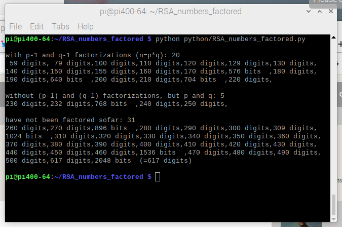
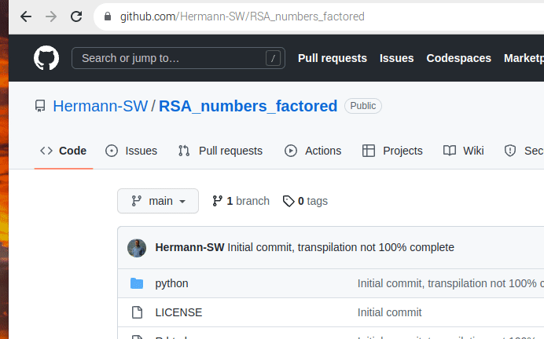
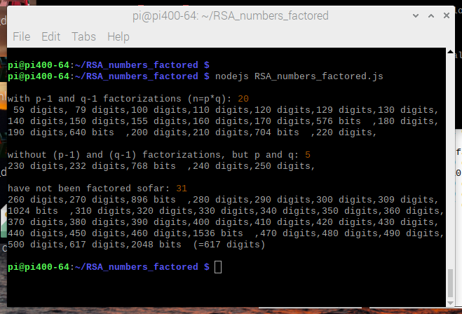
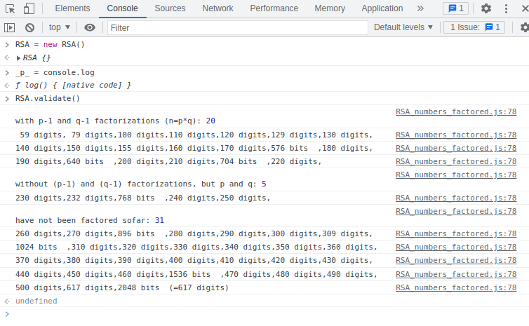

# RSA_numbers_factored

* [Introduction](#introduction)
* Functionality validation:
  * [Python, browser and nodejs demos](#functionality-validation-python-browser-and-nodejs-demos)
  * [Python snapshot](#functionality-validation-python-snapshot)
* [Multiple precision integer performance across languages](performance/README.md)

## Introduction 

Associated forum thread:  
[https://forums.raspberrypi.com/viewtopic.php?t=343468](https://forums.raspberrypi.com/viewtopic.php?t=343468)

Continuation of [RSA_numbers_factored.py gist](https://gist.github.com/Hermann-SW/839dfe6002810d404e3f0fe1808a6333) (details on [Python implementation](python/README.md)), with transpiled [RSA_numbers_factored.js](RSA_numbers_factored.js) (from the Python version) and HTML demos:

* [R.html](R.html)  browser term output RSA tuples if both prime factors are ≡1 (mod 4)  
* [validate.html](validate.html)  do validation, with output in browser term  
* [squares.html](squares.html)  initial version, dynamical onclick buttons if ≡1 (mod 4)  
* [sq2.html](R.html)  browser term output, determine sum of squares for 2467-digit prime  

Transpilation was done manually, using these templates:  
[human_transpiler.templates.md](human_transpiler.templates.md)  

Works with help of added JavaScript implementation for sympy functions gcd and isprime, and functions from itertools.

## Functionality validation 

### Python, browser and nodejs demos 

Just executing RSA_numbers_factored.py does functionality validation with lots of asserts:  


Below screen recording of browser validation corresponds to above Python validation, just in browser term:  
https://hermann-sw.github.io/RSA_numbers_factored/validate.html  


Executing transpiled RSA_numbers_factored.js executes same functionality validation with console.log output:  


Finally, if redirecting output for JavaScript "print()" implementation to console.log, validation can be done in developer tools browser console as well:  


### (Python) snapshot 
Since validation code is likely to change (location as well as content) in future, here just current snapshot (out of order) to get an idea what all gets validated, and how validation output gets created:  
```python
if __name__ == "__main__":
    RSA().validate()
```
```python
class RSA:
...
    def validate(self) -> None:
        ... (multiline comment)
        r = self.factored_2()[-1]
        l, _n, p, q, pm1, qm1 = r
        assert (p - 1) * (q - 1) == self.totient(r)
        assert self.totient_2(r) == self.totient_2(l)
        assert self.totient_2(r) == dictprod_totient(pm1, qm1)
        assert pow(65537, self.reduced_totient_2(190), self.reduced_totient(190)) == 1
        assert len(self.factored()) == 25
        assert len(self.factored_2()) == 20

        r = self.get(2048)
        assert r[0] == 2048 and bits(r[1]) == 2048
        assert r == self.get_(r)
        assert r == self.get_(2048)

        assert self.index(617) == len(rsa) - 2

        r = self.get(250)
        [a, b], [c, d] = self.square_diffs(r)
        assert r[0] == 250 and a ** 2 - b ** 2 == r[1] and c ** 2 - d ** 2 == r[1]

        r = self.get(129)
        [a, b], [c, d] = self.square_sums(r)
        assert r[0] == 129 and a ** 2 + b ** 2 == r[1] and c ** 2 + d ** 2 == r[1]
        a, b, c, d = self.square_sums_4(r)
        assert a ** 2 + b ** 2 + c ** 2 + d ** 2 == r[1]

        validate(rsa)
```
```python
def validate(rsa_):
    ... (multiline comment)
    print(
        "\nwith p-1 and q-1 factorizations (n=p*q):",
        len(["" for r in rsa if len(r) == 6]),
    )
    br = 6
    assert len(["" for r in rsa_ if len(r) == 6]) == 20
    for (i, r) in enumerate(rsa_):
        if has_factors_2(r):
            (l, n, p, q, pm1, qm1) = r
        elif has_factors(r):
            (l, n, p, q) = r
        else:
            (l, n) = r

        assert l == digits(n) or l == bits(n)

        if i > 0:
            assert n > rsa_[i - 1][1]

        if has_factors(r):
            assert n == p * q
            assert isprime(p)
            assert isprime(q)
            assert pow(997, primeprod_totient(p, q), n) == 1
            assert pow(997, primeprod_reduced_totient(p, q), n) == 1

        if has_factors_2(r):
            for k in pm1.keys():
                assert isprime(k)

            for k in qm1.keys():
                assert isprime(k)

            assert dict_int(pm1) == p - 1
            assert dict_int(qm1) == q - 1

            assert pow(997, dict_totient(pm1), p - 1) == 1
            assert pow(997, dict_totient(qm1), q - 1) == 1

            assert (
                pow(
                    65537,
                    dictprod_reduced_totient(pm1, qm1),
                    primeprod_reduced_totient(p, q),
                )
                == 1
            )

            # this does only work for RSA number != RSA-190
            if l != 190:
                assert (
                    pow(65537, dictprod_totient(pm1, qm1), primeprod_totient(p, q)) == 1
                )

        if not has_factors_2(r) and has_factors_2(rsa_[i - 1]):
            print(
                "\n\nwithout (p-1) and (q-1) factorizations, but p and q:",
                len(["" for r in rsa_ if len(r) == 4]),
            )
            br = 3
            assert len(["" for r in rsa_ if len(r) == 4]) == 5

        if not has_factors(r) and has_factors(rsa_[i - 1]):
            print(
                "\nhave not been factored sofar:",
                len(["" for r in rsa_ if len(r) == 2]),
            )
            br = 3
            assert len(["" for r in rsa_ if len(r) == 2]) == 31

        print(
            "%3d" % l,
            ("bits  " if l == bits(n) else "digits")
            + (
                ","
                if i < len(rsa_) - 1
                else "(=" + str(digits(rsa_[-1][1])) + " digits)\n"
            ),
            end="\n" if i % 7 == br or i == len(rsa_) - 1 else "",
        )

    validate_squares()
```
```python
def validate_squares():
    """avoid R0915 pylint too-many-statements warning for validate()"""
    s = [2, 1, 3, 2, 4, 1]  # 1105 = 5 * 13 * 17 = (2² + 1²) * (3² + 2²) * (4² + 1²)

    p = 1
    for j in range(0, len(s), 2):
        p *= s[j] ** 2 + s[j + 1] ** 2

    l = square_sums_(s)
    for t in l:
        assert t[0] ** 2 + t[1] ** 2 == p

    l = square_sums(s)  # [[4, 33], [9, 32], [12, 31], [23, 24]]
    for t in l:
        assert t[0] ** 2 + t[1] ** 2 == p
        assert t[0] < t[1]
    for j in range(len(l) - 1):
        assert l[j][0] < l[j + 1][0]

    l = square_sums(s, revl=True, revt=True)
    for t in l:
        assert t[0] ** 2 + t[1] ** 2 == p
        assert t[0] > t[1]
    for j in range(len(l) - 1):
        assert l[j][0] > l[j + 1][0]

    sqtst(smp1m4[10:20], 8)

    s = square_sum_prod(rsa[0])
    assert (s[0] ** 2 + s[1] ** 2) * (s[2] ** 2 + s[3] ** 2) == rsa[0][1]

    assert sq2d(257)[0] ** 2 - sq2d(257)[1] ** 2 == 257

    assert sq2(100049)[0] ** 2 + sq2(100049)[1] ** 2 == 100049
```
