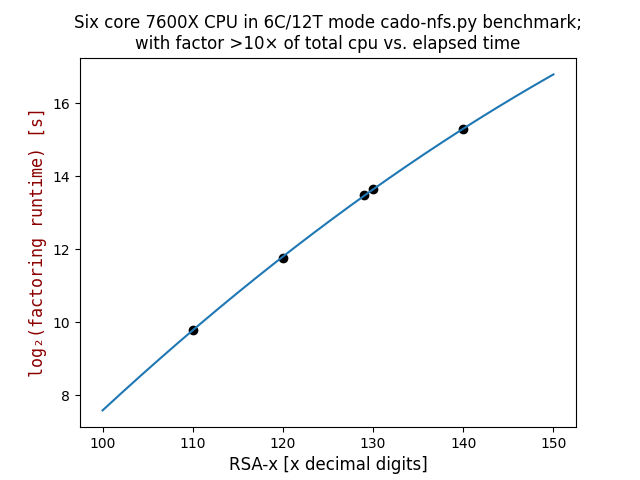
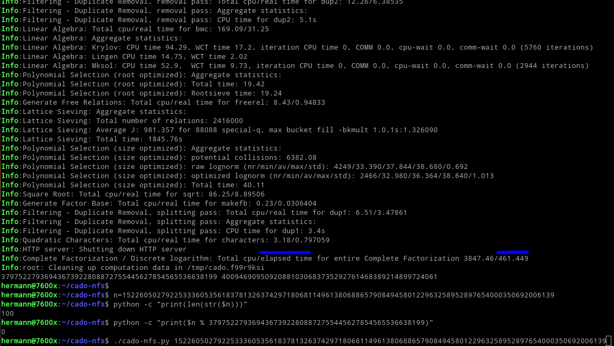
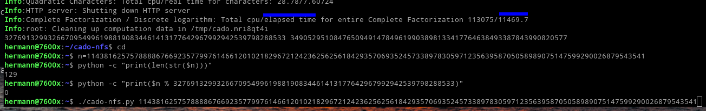
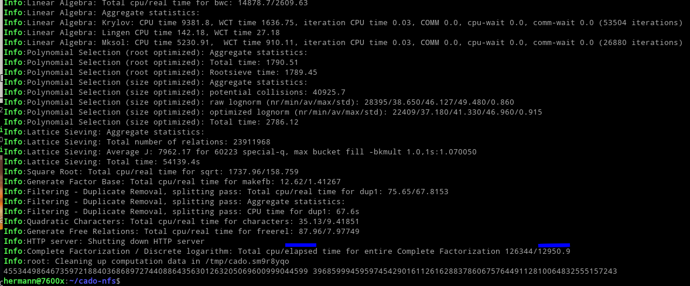

## RSA_numbers

Can be found here:  
https://en.wikipedia.org/wiki/RSA_numbers#RSA-100

RSA-100 .. RSA-250 have been factored, with prime factors listed.  
RSA-260 .. RSA-617/RSA-2048 are unfactored sofar.

## msieve

I had forked msieve repo to be able to do exactly identical (sequential) factorizations of RSA numbers on different platforms:  
https://github.com/Hermann-SW/msieve#readme

This was achieved by:  
- add method to pass random generator seed
- modify code that was dependent on CPU cache size

Factoring of RSA-59 .. RSA-110 was done on different systems, listed in the repo.  
Here only runtimes [h] for AMD Ryzen 5 7600X CPU:  

| RSA | runtime [h] |
|----:|--------:|
|  59 | 0:00:01 |
|  79 | 0:01:10 |
| 100 | 1:32:59 |
| 110 |13:43:43 | 


## cado-nfs

"Parts of the Number Field Sieve computation are massively distributed" was the main argument to try cado-nfs (https://github.com/cado-nfs/cado-nfs) with my new [PC with 7600X CPU](https://github.com/Hermann-SW/7600x#details-of-pc).

### Factoring RSA-x

After RSA-100 was factored in less than 8min(!!) with 12 threads on six-core 7600X CPU (down from 1.5h with msieve), I started factoring RSA-129. That completed in 3:11:10h, leaving me puzzled. I started writing this page and factored missing numbers below RSA-129 as well, and later up to RSA-140.

In this forum posting I added to 2018 statement and i7-12700 measurements:  
https://mersenneforum.org/showthread.php?p=641331#post641331  
Factoring runtimes [h]; my AMD 7950X PC is double as fast as my AMD 7600X PC.  
My new 2×Intel XEON 2680v4 server (89$ ebay spot price, no RAM/no HDDs) worse than 6126.  
This is different to Jean Penne's LLR software PRP(M_52) computation: it outperforms i6126 and 7950X(!):  
|   |           |(Pi5) ARM|Intel    | AMD    |Intel(2CPU)| AMD       | <--    |Intel(8CPU)| <--
|:-:|:---------:|:-------:|:-------:|:------:|:---------:|:---------:|:----:|:---------:|:----------:|
|   | 2018 stmt |A76-3GHz |i7-12700 | 7600X  |XEON 2680v4| 7950X     |      |XEON 8880v3|XEON 8890v4|
|   |           |4C/4T    |12C/20T  | 6C/12T |   28C/56T |   16C/32T | optimized | 144C/288T | 192C/384T |
|RSA|           |60$      |(PC price)| 515$   |    89$    |  890$     | params.X | 399€ | +178€ |
|   | 
|100|     —     | 0:13:30 | 0:07:25 |  0:07:42| 0:07:25  |  0:04:06  |          |    —  |  —    |
|110|    —      | 1:27:27 | 0:27:45 |  0:14:50| 0:12:48  |  0:07:32  |          |    —  |  —    |
|120|    —      | 5:05:17 | 0:54:01 |  0:57:19| 0:47:22  |  0:27:42  |          | 0:43:31 | 0:41:53 |
|129|     —     |    —    |    —    |  3:11:10| 2:54:39  |  1:45:57  | [01:03:09](https://www.mersenneforum.org/showthread.php?t=24274&p=513167) | 1:02:10 | 0:57:08 |
|130| days      |    —    |    —    |  3:35:51|    —     |  1:47:48  | [01:21:46](https://www.mersenneforum.org/showthread.php?t=24274&p=513167) | — | — |
|140| 10+ days  |    —    |    —    | 11:04:51|     —     |  5:21:57  | [04:05:55](https://www.mersenneforum.org/showthread.php?t=24274&&p=513167) | 3:29:25 | 3:15:07 |
|150| month+    |    —    |    —    |    —    |     —     | 26:41:57  | [13:31:36](https://www.mersenneforum.org/showthread.php?t=27315&page=4&p=642545) | — | — |
|155|     —     |    —    |    —    |    —    |     —     |    —      | [25:13h](https://gist.github.com/Hermann-SW/4aefd5b12ff179700bb6594ba25f9646?permalink_comment_id=5697014#gistcomment-5697014) |—|—|
|Passmark|  list|  2,493  | 30,934  | 28,739  |2\*17,619  |  63,287   |         | 78,078 | 102,411 |
|CPUmark|measured| [2,630](https://www.passmark.com/baselines/V11/display.php?id=505363423814)  |   —    | 27,531  |  29,622 |  52,361   | 56,836 | 80,593 | 102,411 |

https://www.cpubenchmark.net/high_end_cpus.html


### RSA-x double logarithmic quadratic regression x/log₂(factoring runtime)

Leaving out runtimes for RSA-100 and below results in nicely fitting regression curve:  
https://github.com/Hermann-SW/QuadraticRegression/blob/master/cado-nfs.RSA-110..140.py

```
$ python cado-nfs.RSA-110..140.py 
y = -0.000885234896525719x² + 0.40522047153410035x - 24.081422840148864
```


### Factoring RSA p-1 and q-1

Then I determined prime factorizations for p-1 and q-1 for RSA-230 .. RSA-250 (with 115..125 decimal digits), allowing for efficient totient_2() and reduced_totient_2() functions for all factored sofar RSA numbers. The RSA_numbers_factored.(py|js|gp) versions were updated with commit [27df24d](https://github.com/Hermann-SW/RSA_numbers_factored/commit/27df24d941eae94428dd8d55868a8adbe8f66624):

| RSA |     |#digits| runtime [h] |  
|----:|-----|------:|------------:|  
| 230 | p-1 |   115 |     0:35:02 |
|     | q-1 |   115 |     0:28:14 |
| 232 | p-1 |   116 |     0:33:09 |
|     | q-1 |   116 |     0:33:35 |
| 768 | p-1 |   116 |     0:32:12 |
|     | q-1 |   116 |     0:28:38 |
| 240 | p-1 |   120 |     0:51:32 |
|     | q-1 |   120 |     0:57:17 |
| 250 | p-1 |   125 |     2:04:25 |
|     | q-1 |   125 |     1:36:22 |

### Factorization end screenshot for RSA-100  


### Factorization end screenshot for RSA-129  


### Factorization end screenshot for RSA-130  



### Factorization end for RSA-768 ```q-1```

Six core 7600X CPU in 6C/12T mode (SMT=Auto in Bios) factored RSA-768 q-1 (116 decimal digits) in 0:28:38h (... Total cpu/elapsed time ... 17709.6/1717.73). That is factor 10.3× of total cpu vs. elapsed time.
```
...
Info:Linear Algebra: Mksol: CPU time 270.16,  WCT time 47.93, iteration CPU time 0.01, COMM 0.0, cpu-wait 0.0, comm-wait 0.0 (6656 iterations)
Info:Quadratic Characters: Starting
Info:Complete Factorization / Discrete logarithm: Quadratic Characters
Info:Quadratic Characters: Total cpu/real time for characters: 7.9/2.04173
Info:Square Root: Starting
Info:Square Root: Creating file of (a,b) values
Info:Square Root: finished
Info:Square Root: Factors: 2 359 25589166898885508654766458077735343058690221562913013678743755072295083333225124814326892161139840020955987977931
Info:Complete Factorization / Discrete logarithm: Square Root
Info:Square Root: Total cpu/real time for sqrt: 0.01/0.00718975
Info:HTTP server: Got notification to stop serving Workunits
Info:Generate Free Relations: Total cpu/real time for freerel: 21.61/2.16019
Info:Quadratic Characters: Total cpu/real time for characters: 7.9/2.04173
Info:Filtering - Singleton removal: Total cpu/real time for purge: 57.33/41.2436
Info:Filtering - Merging: Total cpu/real time for merge: 46.34/5.44049
Info:Filtering - Merging: Total cpu/real time for replay: 7.57/5.99188
Info:Filtering - Duplicate Removal, removal pass: Total cpu/real time for dup2: 85.88/66.9334
Info:Filtering - Duplicate Removal, removal pass: Aggregate statistics:
Info:Filtering - Duplicate Removal, removal pass: CPU time for dup2: 43.10000000000001s
Info:Linear Algebra: Total cpu/real time for bwc: 794.05/149.82
Info:Linear Algebra: Aggregate statistics:
Info:Linear Algebra: Krylov: CPU time 489.78, WCT time 87.33, iteration CPU time 0.01, COMM 0.0, cpu-wait 0.0, comm-wait 0.0 (13184 iterations)
Info:Linear Algebra: Lingen CPU time 18.5, WCT time 9.48
Info:Linear Algebra: Mksol: CPU time 270.16,  WCT time 47.93, iteration CPU time 0.01, COMM 0.0, cpu-wait 0.0, comm-wait 0.0 (6656 iterations)
Info:Polynomial Selection (root optimized): Aggregate statistics:
Info:Polynomial Selection (root optimized): Total time: 95.81
Info:Polynomial Selection (root optimized): Rootsieve time: 95.44
Info:Lattice Sieving: Aggregate statistics:
Info:Lattice Sieving: Total number of relations: 6936309
Info:Lattice Sieving: Average J: 1917.96 for 126074 special-q, max bucket fill -bkmult 1.0,1s:1.279180
Info:Lattice Sieving: Total time: 8301.83s
Info:Polynomial Selection (size optimized): Aggregate statistics:
Info:Polynomial Selection (size optimized): potential collisions: 23161.9
Info:Polynomial Selection (size optimized): raw lognorm (nr/min/av/max/std): 15922/33.080/41.266/48.130/1.092
Info:Polynomial Selection (size optimized): optimized lognorm (nr/min/av/max/std): 11652/33.040/36.465/41.610/0.802
Info:Polynomial Selection (size optimized): Total time: 827.01
Info:Square Root: Total cpu/real time for sqrt: 0.01/0.00718975
Info:Generate Factor Base: Total cpu/real time for makefb: 1.24/0.147012
Info:Filtering - Duplicate Removal, splitting pass: Total cpu/real time for dup1: 20.25/14.6815
Info:Filtering - Duplicate Removal, splitting pass: Aggregate statistics:
Info:Filtering - Duplicate Removal, splitting pass: CPU time for dup1: 14.299999999999999s
Info:HTTP server: Shutting down HTTP server
Info:Complete Factorization / Discrete logarithm: Total cpu/elapsed time for entire Complete Factorization 17709.6/1717.73
Info:root: Cleaning up computation data in /tmp/cado.6esyz979
2 359 25589166898885508654766458077735343058690221562913013678743755072295083333225124814326892161139840020955987977931
hermann@7600x:~/cado-nfs$ 
```

The last line of output shows the primes that divide ```q-1```.  
Exponents can easily be determined with PARI/GP's ```gp```:  
```
pi@pi400-64:~/RSA_numbers_factored/pari $ gp -q
? \r RSA_numbers_factored
? [l,n,p,q]=rsa[23][1..4];
? addprimes([2, 359, 25589166898885508654766458077735343058690221562913013678743755072295083333225124814326892161139840020955987977931]);
? factor(q-1)

[2 2]

[359 1]

[25589166898885508654766458077735343058690221562913013678743755072295083333225124814326892161139840020955987977931 1]

? q-1 == 2^2 * 359 * 25589166898885508654766458077735343058690221562913013678743755072295083333225124814326892161139840020955987977931
1
? 
```


### Factorization end screenshot for RSA-140 and electric energy consumption
 
Six core 7600X CPU in 6C/12T mode (SMT=Auto in Bios) factored in RSA-140 in 11:04:51h. Again with factor of total cpu vs. elapsed time (433973/39890.5 = 10.88×) bigger than 10×. Power consumption during computation was 0.12KW measured with wattmeter over some hours for the 7600X PC. Therefore complete factorization of RSA-140 had 1.33KWh power consumption.
```
...
Info:Square Root: Starting
Info:Square Root: Creating file of (a,b) values
Info:Square Root: finished
Info:Square Root: Factors: 6264200187401285096151654948264442219302037178623509019111660653946049 3398717423028438554530123627613875835633986495969597423490929302771479
Info:Complete Factorization / Discrete logarithm: Square Root
Info:Square Root: Total cpu/real time for sqrt: 2370.6/216.578
Info:HTTP server: Got notification to stop serving Workunits
Info:Polynomial Selection (root optimized): Aggregate statistics:
Info:Polynomial Selection (root optimized): Total time: 3137.79
Info:Polynomial Selection (root optimized): Rootsieve time: 3136.69
Info:Lattice Sieving: Aggregate statistics:
Info:Lattice Sieving: Total number of relations: 33904331
Info:Lattice Sieving: Average J: 3772.72 for 1026694 special-q, max bucket fill -bkmult 1.0,1s:1.201540
Info:Lattice Sieving: Total time: 204615s
Info:Polynomial Selection (size optimized): Aggregate statistics:
Info:Polynomial Selection (size optimized): potential collisions: 69931.3
Info:Polynomial Selection (size optimized): raw lognorm (nr/min/av/max/std): 48709/41.720/50.158/55.180/0.939
Info:Polynomial Selection (size optimized): optimized lognorm (nr/min/av/max/std): 40192/40.510/44.680/50.820/0.967
Info:Polynomial Selection (size optimized): Total time: 13569.5
Info:Filtering - Duplicate Removal, removal pass: Total cpu/real time for dup2: 411.71/299.165
Info:Filtering - Duplicate Removal, removal pass: Aggregate statistics:
Info:Filtering - Duplicate Removal, removal pass: CPU time for dup2: 218.4s
Info:Square Root: Total cpu/real time for sqrt: 2370.6/216.578
Info:Generate Factor Base: Total cpu/real time for makefb: 3.59/0.409062
Info:Generate Free Relations: Total cpu/real time for freerel: 166.7/14.5645
Info:Quadratic Characters: Total cpu/real time for characters: 42.32/11.4271
Info:Filtering - Singleton removal: Total cpu/real time for purge: 237.01/169.183
Info:Filtering - Duplicate Removal, splitting pass: Total cpu/real time for dup1: 113.73/91.1987
Info:Filtering - Duplicate Removal, splitting pass: Aggregate statistics:
Info:Filtering - Duplicate Removal, splitting pass: CPU time for dup1: 90.9s
Info:Filtering - Merging: Total cpu/real time for merge: 302.22/32.3473
Info:Filtering - Merging: Total cpu/real time for replay: 40.96/32.651
Info:Linear Algebra: Total cpu/real time for bwc: 21124.2/3688.07
Info:Linear Algebra: Aggregate statistics:
Info:Linear Algebra: Krylov: CPU time 13360.19, WCT time 2327.54, iteration CPU time 0.03, COMM 0.0, cpu-wait 0.0, comm-wait 0.0 (63488 iterations)
Info:Linear Algebra: Lingen CPU time 183.37, WCT time 31.19
Info:Linear Algebra: Mksol: CPU time 7424.45,  WCT time 1283.8, iteration CPU time 0.04, COMM 0.0, cpu-wait 0.0, comm-wait 0.0 (31744 iterations)
Info:HTTP server: Shutting down HTTP server
Info:Complete Factorization / Discrete logarithm: Total cpu/elapsed time for entire Complete Factorization 433973/39890.5
Info:root: Cleaning up computation data in /tmp/cado.jpv0ybws
6264200187401285096151654948264442219302037178623509019111660653946049 3398717423028438554530123627613875835633986495969597423490929302771479
hermann@7600x:~/cado-nfs$
```
