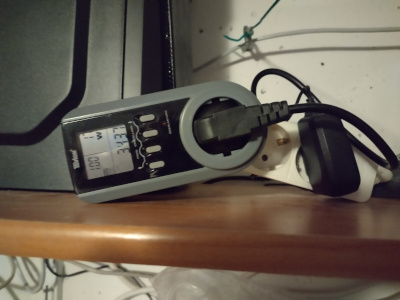

## 347ms computation

Leaving below for history.  
Currently patched LLR 4.0.5 software is not needed.  
Reason is that p=Phi(3,_) genrelized unique primes allow for instantaneous
computation of sqrt(-1) (mod p):  
https://mersenneforum.org/showthread.php?p=651499#post651499

Here detrmination for largest know 11,981,518 decimal digits prime p=1 (mod 4):  
```
? {
b=516693;
e=1048576;
p=polcyclo(3,-b^e);
s=b^(e*3/2);
[M,V]=halfgcd(s,p);
[x,y]=[V[2],M[2,1]];
}
? ##
  ***   last result: cpu time 347 ms, real time 347 ms.
? x^2+y^2==p
%19 = 1
? s^2%p==p-1
%20 = 1
? #digits(p)
%21 = 11981518
?
```


## 8.55 days computation

Computed with patched LLR 4.0.5 software with 16 threads on AMD 7950X CPU forced onto chiplet0.  

Computation of sqrtm1=sqrt(-1) (mod p) of 11,981,518-digit prime p done with ...  
```
nohup ./doit
```

... measured consuming 34.37KWh (167.5W on average) with electricity meter in basement computing center:  
  

Details of computation:  
```
hermann@7950x:~/RSA_numbers_factored/llr/11,981,518$ gzip -dc nohup.out.gz | sed "s/\xd/\n/g"  | wc --lines
5755
hermann@7950x:~/RSA_numbers_factored/llr/11,981,518$ 
```

Phi(3,-516693^1048576) is largest prime =1 (mod 4) since 9/2023:  

https://t5k.org/primes/lists/all.txt
```
as of 2/15/2024
-----  ------------------------------- -------- ----- ---- --------------
 rank  description                     digits   who   year comment
-----  ------------------------------- -------- ----- ---- --------------
    1  2^82589933-1                    24862048 G16   2018 Mersenne 51??
    2  2^77232917-1                    23249425 G15   2018 Mersenne 50??
    3  2^74207281-1                    22338618 G14   2016 Mersenne 49??
    4  2^57885161-1                    17425170 G13   2013 Mersenne 48
    5  2^43112609-1                    12978189 G10   2008 Mersenne 47
    6  2^42643801-1                    12837064 G12   2009 Mersenne 46
    7e Phi(3,-516693^1048576)          11981518 L4561 2023 Generalized unique
    8  Phi(3,-465859^1048576)          11887192 L4561 2023 Generalized unique
```

Too much errors, restarting with next larger FFT after 16480000\*0.012927/(3600\*24)=2.46 days
```
...
516693^2097152-516693^1048576+1, bit: 16480000 / 39801738 [41.40%].  Time per bit: 12.927 ms.
                                                                                                   
Disregard last error.  Result is reproducible and thus not a hardware problem.
                                                                                                   
Too much errors ; Restarting with next larger FFT length...
Continuing from last save file.
Starting N-1 prime test of 516693^2097152-516693^1048576+1
Using generic reduction AVX-512 FFT length 4320K, Pass1=960, Pass2=4608, clm=1, 16 threads, a = 616139

516693^2097152-516693^1048576+1, bit: 10000 / 39801738 [0.02%].  Time per bit: 13.293 ms.
516693^2097152-516693^1048576+1, bit: 20000 / 39801738 [0.05%].  Time per bit: 13.237 ms.
...
```

6 errors are "too much":  
```
hermann@7950x:~$ sed "s/\xd/\n/g" RSA_numbers_factored/llr/11,981,518/nohup.out | grep Iter
Iter: 7649671/39801738, ERROR: ROUND OFF (0.4150517997) > 0.4
Iter: 8960757/39801738, ERROR: ROUND OFF (0.4127535019) > 0.4
Iter: 10295535/39801738, ERROR: ROUND OFF (0.4074020849) > 0.4
Iter: 14575281/39801738, ERROR: ROUND OFF (0.4159104628) > 0.4
Iter: 15709944/39801738, ERROR: ROUND OFF (0.4072049887) > 0.4
Iter: 16485874/39801738, ERROR: ROUND OFF (0.4422892498) > 0.4
hermann@7950x:~$
```

Computation with next larger FFT completed without errors in 526134.025/(24\*3600)=6.09 days, 8.55 days in total:
```
hermann@7950x:~/RSA_numbers_factored/llr/11,981,518$ sed "s/\xd/\n/g" nohup.out | tail -5
516693^2097152-516693^1048576+1, bit: 39790000 / 39801738 [99.97%].  Time per bit: 13.205 ms.
516693^2097152-516693^1048576+1, bit: 39800000 / 39801738 [99.99%].  Time per bit: 13.200 ms.

  Time : 526134.025 sec.
1
hermann@7950x:~/RSA_numbers_factored/llr/11,981,518$ 
```

## Validation of sqrtm1.gp and sos.gp

PARI/GP:  
```
hermann@7950x:~/RSA_numbers_factored/llr/11,981,518$ cat validate.gp 
p=polcyclo(3,-516693^1048576);
##
print()

s=readvec("sqrtm1.gp")[1];
##
s^2%p==p-1
##

[x,y]=readvec("sos.gp")[1];
##
x^2+y^2==p
##
hermann@7950x:~/RSA_numbers_factored/llr/11,981,518$
hermann@7950x:~/RSA_numbers_factored/llr/11,981,518$ gp -q < validate.gp 
  ***   last result: cpu time 105 ms, real time 118 ms.

  ***   last result: cpu time 49 ms, real time 57 ms.
1
  ***   last result: cpu time 305 ms, real time 317 ms.
  ***   last result: cpu time 53 ms, real time 53 ms.
1
  ***   last result: cpu time 68 ms, real time 68 ms.
hermann@7950x:~/RSA_numbers_factored/llr/11,981,518$ 
```

[validate.py](validate.py), Python with gmpy2:  
```
hermann@7950x:~/RSA_numbers_factored/llr/11,981,518$ time ./validate.py 
True
True

real	0m1.771s
user	0m1.663s
sys	0m0.108s
hermann@7950x:~/RSA_numbers_factored/llr/11,981,518$ 
```

[validate.js](validate.js), Node with BigInt:  
```
hermann@7950x:~/RSA_numbers_factored/llr/11,981,518$ time ./validate.js 
true
true

real	0m1.984s
user	0m1.926s
sys	0m0.072s
hermann@7950x:~/RSA_numbers_factored/llr/11,981,518$ 
```

[validate.cc](validate.cc), C++ with libgmpxx:  
```
hermann@7950x:~/RSA_numbers_factored/llr/11,981,518$ make validate
g++ -O3 validate.cc -lgmpxx -lgmp -o validate.cc.out
./validate.cc.out
11981518 decimal digits prime p
0.008523s for mpz_set_str() of 7462826 hexadecimal digits sqrt(-1) (mod p)
1.56775s for computing powm(_, sqrtm1, 2, p)
1 (sqrtm1*sqrtm1 % p == p-1)
0.00625s for mpz_set_str() of x and y
1 (x*x + y*y == p)
hermann@7950x:~/RSA_numbers_factored/llr/11,981,518$ 
```

## determining sum of squares from sqrtm1 in 174ms
```
hermann@7950x:~/RSA_numbers_factored/llr/11,981,518$ gp -q < sqrtm12sos.gp 
11981518-digit prime p (39801739 bits)
[M,V] = halfgcd(sqrtm1, p)
  ***   last result: cpu time 173 ms, real time 173 ms.
[x,y] = [V[2], M[2,1]]
  ***   last result: cpu time 1 ms, real time 1 ms.
done, all asserts OK
hermann@7950x:~/RSA_numbers_factored/llr/11,981,518$ 
```

## determining sqrtm1 from sum of squares in 485ms
```
hermann@7950x:~/RSA_numbers_factored/llr/11,981,518$ gp -q < sos2sqrtm1.gp 
11981518-digit prime p (39801739 bits)
sqrtm1 = lift(Mod(x, p)/y)
  ***   last result: cpu time 461 ms, real time 485 ms.
done, all asserts OK
hermann@7950x:~/RSA_numbers_factored/llr/11,981,518$ 
```
