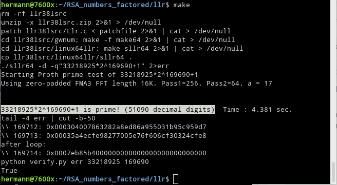

## introduction

LLR version 3.8.21 [llr38lsrc.zip](llr38lsrc.zip) copied from Jean Penné's download page [http://jpenne.free.fr/index2.html](http://jpenne.free.fr/index2.html) is the last that works with AMD64 CPUs for Proth primes  *p > 2^100000*.

[patchfile](patchfile) does write the last 100 computed values of LLR to stderr. The last value before "after loop:" is *sqrt(-1) (mod p)*.

## build and run

Just run:
```
make [clean]
```

LLR does work on x86 CPUs only.  
In addition [Makefile](Makefile) stops working if ```uname -m``` does not return ```x86_64```.

In case ```python``` is installed, final verification of computed demo output gets verified with [verify.py](verify.py):  
(that computed result from 3rd last line of created ```err``` file is *sqrt(-1) (mod p)* for demo 51090-digit prime *p=33218925\*2^169690+1*)


## verify for 9,383,761-digit largest known prime that is =1 (mod 4)

I stopped verify.py after 12min on 7600X CPU, Python ```pow(x, 2, p)``` cannot efficiently deal with such big prime *p*.

Verfification with PARI/GP command line tool is instant:  
```
hermann@7600x:~$ tail -3 err | head -1 | sed "s/^.*:/x =/;s/$/;/" > x.gp
hermann@7600x:~$ head --bytes 20 x.gp; echo -n " ... "; tail --bytes 20 x.gp
x = 0x00046e2f05e9c0 ... b0f271defb6a6b9e3f;
hermann@7600x:~$ gp -q
? \r x
? #digits(x)
9383761
? p = 10223*2^31172165+1;
? x^2 % p == p-1
1
? 
```

Unlike with Llr 4.0.4 on Intel CPU, 3.8.21 Llr does write out all last 100  loop values, and the after loop value (*p-1*). Last value before "after loop:" is *sqrt(-1) (mod p)* as has just been verified:  
```
hermann@7600x:~$ tail -4 err | cut -b-50
\\ 31172176: 0x000033a4eaeb86984445daf8fa4b8884718
\\ 31172177: 0x00046e2f05e9c03d745f20c07c68c289093
after loop:
\\ 31172178: 0x0004fde0000000000000000000000000000
hermann@7600x:~$ 
```

I did determine *sqrt(-1) (mod p)* for 9,383,761-digit prime *p* with this command (tests revealed that number of Llr threads set with ```-t``` was best the number of cores 6; 7600X CPU number of hardware threads is 12):  
```
nohup ./sllr64 -t6 -d -q"10223*2^31172165+1" 2>err
```

The command finished in only 38701s = 10:45:01h !  
I computed same value with 24C/48T and Llr ```-t24``` on old Intel machine in 13.2h before:  
https://github.com/Hermann-SW/9383761-digit-prime#fast-sqrt-1-mod-p-for-9383761-digit-prime-p-1-mod-4  
```
hermann@7600x:~$ sed "s/^M/\n/g" nohup.out | tail 
10223*2^31172165+1, bit: 31110000 / 31172178 [99.80%].  Time per bit: 1.238 ms.
10223*2^31172165+1, bit: 31120000 / 31172178 [99.83%].  Time per bit: 1.239 ms.
10223*2^31172165+1, bit: 31130000 / 31172178 [99.86%].  Time per bit: 1.240 ms.
10223*2^31172165+1, bit: 31140000 / 31172178 [99.89%].  Time per bit: 1.241 ms.
10223*2^31172165+1, bit: 31150000 / 31172178 [99.92%].  Time per bit: 1.239 ms.
10223*2^31172165+1, bit: 31160000 / 31172178 [99.96%].  Time per bit: 1.237 ms.
10223*2^31172165+1, bit: 31170000 / 31172178 [99.99%].  Time per bit: 1.236 ms.
                                                                                                   
                                                                                                   
10223*2^31172165+1 is prime! (9383761 decimal digits)  Time : 38700.697 sec.
hermann@7600x:~$ 
```
