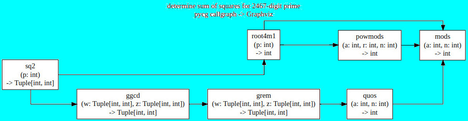
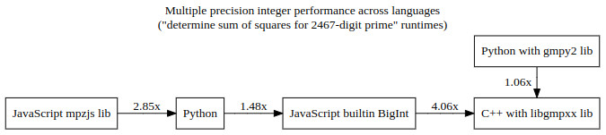
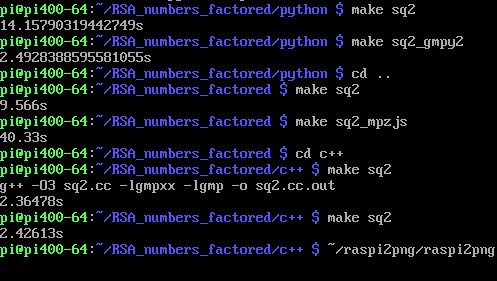
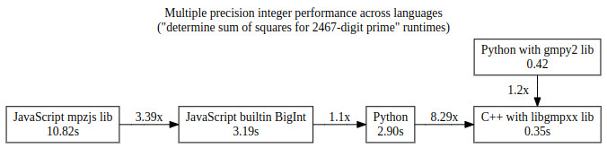
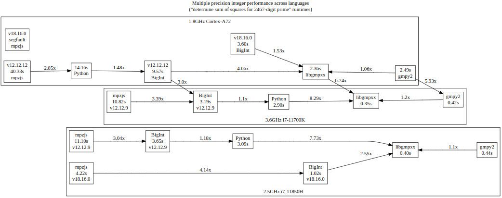
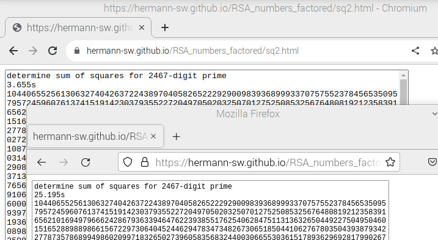
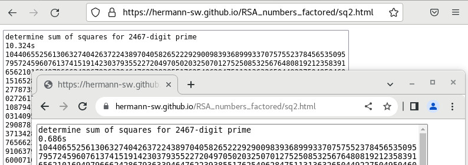
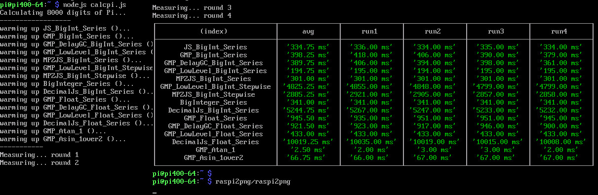

# Multiple precision integer performance across languages

This performance investigation is on multiple precision integer performance, but not low level as with C libgmp or gpm-wasm low level functions. Reason is that the (fast) code looks ugly that way, and at least for C++ and Python there are high performance and nice looking alternatives.

### C++
C++ [libgmpxx](https://gmplib.org/manual/C_002b_002b-Class-Interface) is nice and performant wrapper for libgmp. Small function ```mods()``` computing "signed mod" example:
```
mpz_class mods(mpz_class a, mpz_class n) {
    assert(n > 0);
    a = a % n;
    if (2 * a > n) {
        a -= n;
    }
    return a;
}
```


### NodeJS/JavaScript

The gmp-wasm calcpi.js benchmark gives some ideas on options other than to use builtin BigInt type. But BigInt type is the best, see [calcpi.js](#calcpijs) section for details. BigInt implementation of ```mods()``` is nice:
```
function mods(a, n){
    assert(n > 0n);
    a = a % n;
    if (2n * a > n){
        a -= n;
    }
    return a;
}
```
"mpzjs" library code uses more low-level functions, and is much less performant than BigInt:  
```
function mods(a, n){
    assert(n > 0);
    a = a.mod(n);
    if (a.mul(2) > n){
        a = a.sub(n);
    }
    return a;
}
```


### Python
"gmpy2" library allows for libgmpxx performance, while code does look identical to "normal" Python code. The performance difference results just by passing either Python int ```2 ** 2 ** 13 + 897``` or gmpy2 ```mpz(2 ** 2 ** 13 + 897)```. Here is ```mods()``` with type hinting for "normal" Python ```int``` type:
```
def mods(a: int, n: int) -> int:
    """returns "signed" a (mod n), in range -n//2..n//2"""
    assert n > 0
    a = a % n
    if 2 * a > n:
        a -= n
    return a
```

## Benchmarks

The benchmark used to compare more than the few multiple precision functions from "calcpi.js" is function ```sq2(p)```, that returns tupe/array/pair (Python/NodeJS/C++) containing numbers whose squares add up to passed number ```p```, which is asserted to be prime number and =1 (mod 4). That function, and other signed mod and Gaussian integer (complex number whose real and imaginary parts are both integers) functions were 2010 Robert Chapman Python code, which was transpiled to JavaScript manually, and transpiled to C++ further from there. That construction process makes the Python/NodeJS/C++ code "the same" and good for cross language performance comparison. While "Gaussian integer Greatest Common Divisor" function ```ggcd(w, z)``` has efficient (logarithmic in input size) runtime, computing sum of squares for 2467-digit (8193-bit) prime number takes some seconds on Cortex-A72 at least.

Python sympy ```gcd()``` is still not able to compute GCD of Gausssian Integers. Reference to fast Gaussian Integer GCD algorithms from the literature, link to Robin Chapman 2010 code for ```sq2()``` used in this benchmark, and reference to this performance evalution added to sympy repo issue:  
[https://github.com/sympy/sympy/issues/15358#issuecomment-1550977489](https://github.com/sympy/sympy/issues/15358#issuecomment-1550977489)

## 2467-digit sum of squares benchmark

All source code can be found in this repo. The diagram shows the Python callgraph for this benchmark. [sq2.py](../python/sq2.py) calls function "sq2()" from [RSA_numbers_factored.py](../python/RSA_numbers_factored.py). Because Python got transpiled to NodeJS and then C++, it is the callgraph for them as well. More detailed documentation with examples here:  
[python/docs/RSA_numbers_factored.py.md#function-section1](../python/docs/RSA_numbers_factored.py.md#function-section1)  

| | | |
|-|-|-|
| prime =1 (mod 4) function | sq2(p) | returns pair of numbers, their squares summing up to p |
| Gaussian integer functions  | ggcd(w, z) | returns greatest common divisor for gaussian integers |
| | grem(w, z) | returns remainder in Gaussian integers when dividing w by z |
| Signed mod functions | root4m1(p) | returns sqrt(-1) (mod p) |
| | quos(a, n) | returns equivalent of "a//n" for signed mod |
| | powmods(a, r, n) | returns "signed" a**r (mod n), in range -n//2..n//2 |
| | mods(a, n) |  returns "signed" a (mod n), in range -n//2..n//2 |



### Arm
1.8GHz Cortex-A72 CPU measured runtimes (with nodejs v12.12.12):   
  

Best is 2.36s at bottom for C++ with libgmpxx, but Python with gmpy2 lib is nearly as efficient with 2.49s. Best NodeJS option with builtin BigInt is much slower with 9.57s.  


After upgrading to latest stable node v18.16.0 ...  
```
$ sudo npm install -g n

changed 1 package in 810ms
$ sudo n stable
     copying : node/18.16.0
   installed : v18.16.0 (with npm 9.5.1)
$ node -v
v18.16.0
$ 
```
... nodejs runtimes got much better for BigInt, but mpzjs segfaults (new Makefile targets):
```
pi@pi400-64:~/RSA_numbers_factored $ make sq2_
3.596s
pi@pi400-64:~/RSA_numbers_factored $ make sq2_mpzjs_
Segmentation fault
make: *** [Makefile:26: sq2_mpzjs_] Error 139
pi@pi400-64:~/RSA_numbers_factored $ 
```

### Intel
3.6GHz i7-11700K CPU (with nodejs v12.12.9) is much faster, measured runtimes in the diagram:  


2.5GHz i7-11850H CPU (with nodejs v12.12.9) is only slightly slower than i7-11700K despite the reduced CPU frequency. But upgrading to node v18.16.0 as shown in Arm section, mpzjs as well as BigInt runtimes got much better:  
```
RSA_numbers_factored$ make sq2_
1.024s
RSA_numbers_factored$ make sq2_mpzjs_
4.223s
RSA_numbers_factored$ 
```

### Summary

Combined view, with cross CPU runtime factors between Python with gmpy2, C++ with libgmpxx and JavaScript with BigInt (the best option for non low-level NodeJS code). With latest stable node v18.16.0, BigInt runtime got much better. But it is still 53%/155% worse than C++ with libgmpxx on Arm/Intel, while Python with gmpy2 is much closer to libgmpxx:  


### Browsers

NodeJS BigInt script [sq2.js](../sq2.js) was converted to [sq2.html](../sq2.html) for benchmarking browser, online here:  
[https://hermann-sw.github.io/RSA_numbers_factored/sq2.html](https://hermann-sw.github.io/RSA_numbers_factored/sq2.html)  

Surprisingly Firefox is much slower than Chromium/Chrome on Arm as well as on Intel.  

Arm (1.8GHz Cortex-A72; Chromium top, Firefox bottom):  


Intel (2.5GHz i7-11850H; Firefox top, Chrome bottom):  


## calcpi.js

There are two benchmarks in [gmp-wasm repo](https://github.com/Daninet/gmp-wasm/tree/master/benchmark), see also [Performance](https://github.com/Daninet/gmp-wasm/tree/master#performance) section in that repo. "mulspeed.js" only tests multiplication of two 30,000-digit numbers (for mpzjs and gmp-wasm libraries, and JavaScript native BigInt). Better suited to compare more operations for other multiple precision libraries is "calcpi.js". This gist makes "calcpi.js" work with NodeJS v12.22.x with small diff:  
[https://gist.github.com/Hermann-SW/615c6409d2d3de9a0916c87e857d9cb3](https://gist.github.com/Hermann-SW/615c6409d2d3de9a0916c87e857d9cb3)

For execution of "calcpi.js", ```npm i decimal.js``` installs all libraries needed (decimal.js, big.js, big-integer, gmp-wasm, pi-decimals, mpzjs).

### Arm 
The measurements were done on 1.8GHz Cortex-A72 CPU (without GUI in console mode) with NodeJS v12.22.12. Both *gmp-wasm without low-level functions* are worse than builtin BigInt here. While using mpzjs library shows 10% improvement for Arm, the other benchmark above showed 185% slowdown over native BigInt. So without low-level gmp-wasm functions, best NodeJS option is to use builtin BigInt.



### Intel

The measurements were made with Node.js v12.22.9 on 3.6GHz i7-11700K. Here all gmp-wasm options are worse than builtin BigInt. Only mpzjs library shows improvement over using builtin BigInt (3.5%), but the other benchmark above showed 219% slowdown. So best option here is NodeJS with BigInt as well.  
```
...
Measuring... round 4
┌──────────────────────────────┬─────────────┬─────────────┬─────────────┬─────────────┬─────────────┐
│           (index)            │     avg     │    run1     │    run2     │    run3     │    run4     │
├──────────────────────────────┼─────────────┼─────────────┼─────────────┼─────────────┼─────────────┤
│       JS_BigInt_Series       │ '49.50 ms'  │ '51.00 ms'  │ '49.00 ms'  │ '49.00 ms'  │ '49.00 ms'  │
│      GMP_BigInt_Series       │ '78.75 ms'  │ '82.00 ms'  │ '80.00 ms'  │ '77.00 ms'  │ '76.00 ms'  │
│  GMP_DelayGC_BigInt_Series   │ '73.25 ms'  │ '78.00 ms'  │ '73.00 ms'  │ '75.00 ms'  │ '67.00 ms'  │
│  GMP_LowLevel_BigInt_Series  │ '54.00 ms'  │ '54.00 ms'  │ '54.00 ms'  │ '54.00 ms'  │ '54.00 ms'  │
│     MPZJS_BigInt_Series      │ '47.75 ms'  │ '47.00 ms'  │ '47.00 ms'  │ '49.00 ms'  │ '48.00 ms'  │
│ GMP_LowLevel_BigInt_Stepwise │ '957.25 ms' │ '959.00 ms' │ '956.00 ms' │ '957.00 ms' │ '957.00 ms' │
│    MPZJS_BigInt_Stepwise     │ '418.75 ms' │ '420.00 ms' │ '418.00 ms' │ '420.00 ms' │ '417.00 ms' │
│      BigInteger_Series       │ '50.75 ms'  │ '51.00 ms'  │ '51.00 ms'  │ '51.00 ms'  │ '50.00 ms'  │
│   DecimalJs_BigInt_Series    │ '361.00 ms' │ '359.00 ms' │ '360.00 ms' │ '363.00 ms' │ '362.00 ms' │
│       GMP_Float_Series       │ '170.25 ms' │ '171.00 ms' │ '171.00 ms' │ '169.00 ms' │ '170.00 ms' │
...
```

Additional measurements were made with Node.js v12.22.9 on 2.5GHz i7-11850H; they were only slightly slower than on i7-11700K despite the reduced CPU frequency. But after upgrading to latest stable node v18.16.0, runtimes got much better. Here node with BigInt is clearly the best option.
```
...
Measuring... round 4
┌──────────────────────────────┬─────────────┬─────────────┬─────────────┬─────────────┬─────────────┐
│           (index)            │     avg     │    run1     │    run2     │    run3     │    run4     │
├──────────────────────────────┼─────────────┼─────────────┼─────────────┼─────────────┼─────────────┤
│       JS_BigInt_Series       │ '34.50 ms'  │ '34.00 ms'  │ '35.00 ms'  │ '34.00 ms'  │ '35.00 ms'  │
│      GMP_BigInt_Series       │ '65.75 ms'  │ '68.00 ms'  │ '65.00 ms'  │ '65.00 ms'  │ '65.00 ms'  │
│  GMP_DelayGC_BigInt_Series   │ '58.00 ms'  │ '58.00 ms'  │ '58.00 ms'  │ '58.00 ms'  │ '58.00 ms'  │
│  GMP_LowLevel_BigInt_Series  │ '41.50 ms'  │ '41.00 ms'  │ '42.00 ms'  │ '42.00 ms'  │ '41.00 ms'  │
│     MPZJS_BigInt_Series      │ '36.00 ms'  │ '36.00 ms'  │ '36.00 ms'  │ '36.00 ms'  │ '36.00 ms'  │
│ GMP_LowLevel_BigInt_Stepwise │ '950.00 ms' │ '948.00 ms' │ '947.00 ms' │ '956.00 ms' │ '949.00 ms' │
│    MPZJS_BigInt_Stepwise     │ '413.50 ms' │ '412.00 ms' │ '411.00 ms' │ '415.00 ms' │ '416.00 ms' │
│      BigInteger_Series       │ '35.25 ms'  │ '34.00 ms'  │ '34.00 ms'  │ '39.00 ms'  │ '34.00 ms'  │
│   DecimalJs_BigInt_Series    │ '380.75 ms' │ '375.00 ms' │ '370.00 ms' │ '408.00 ms' │ '370.00 ms' │
│       GMP_Float_Series       │ '133.00 ms' │ '136.00 ms' │ '133.00 ms' │ '133.00 ms' │ '130.00 ms' │
...
```
