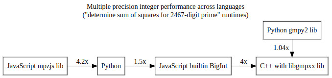
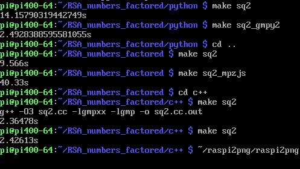
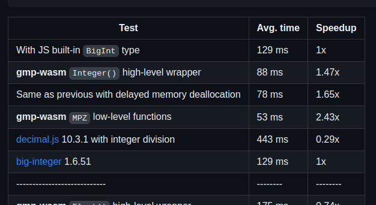

# Multiple precision integer performance across languages

This performance investigation is on multiple precision integer performance, but not low level as with C libgmp or gpm-wasm low level functions. Reason is that the (fast) code looks ugly that way, and at least for C++ and Python there are high performant and nice looking alternatives.

### C++
C++ [libgmpxx](https://gmplib.org/manual/C_002b_002b-Class-Interface) is nice and performant wrapper for libgmp. Here small function ```mods()``` computing "signed mod":
```
    mpz_class mods(mpz_class a, mpz_class n) {
        assert(n > 0);
        a = a % n;
        if (2 * a > n) {
            a -= n;
        }
        return a;
    }
```


### NodeJS/JavaScript

The gmp-wasm calcpi.js benchmark gives some ideas on options other than to use builtin BigInt type. While the repo analysis seems promising for Intel CPU, no performance improvement is possible over native BigInt without using low level gmp-wasm, which is not wanted (see [calcpi.js](#calcpijs) section). BigInt implementation of ```mods()``` looks nice:
```
function mods(a, n){
    assert(n > 0n);
    a = a % n;
    if (2n * a > n){
        a -= n;
    }
    return a;
}
```
"mpzjs" library code uses more low-level functions:  
```
function mods(a, n){
    assert(n > 0);
    a = a.mod(n);
    if (a.mul(2) > n){
        a = a.sub(n);
    }
    return a;
}
```


### Python
"gmpy2" library allows for libgmpxx performance, while code does look identical to "normal" Python code. The performance difference results just by passing either ```2 ** 2 ** 13 + 897``` or ```mpz(2 ** 2 ** 13 + 897)```. Here is ```mods()``` with type hinting for "normal" Python ```int``` type:
```
def mods(a: int, n: int) -> int:
    """returns "signed" a (mod n), in range -n//2..n//2"""
    assert n > 0
    a = a % n
    if 2 * a > n:
        a -= n
    return a
```


The benchmark I used to compare more than the few multiple precision functions from "calcpi.js" is function ```sq2(p)```, that returns pair/array/tuple (C++/NodeJS/Python) containing numbers whose squares add up to passed ```p```, which is asserted to be prime number and =1 (mod 4). That function, and other signed mod and Gaussian integer (complex number whose real and imaginary parts are both integers) fuctions were 2010 Robert Chapman Python code, that I transpiled to JavaScript manually, and transpiled to C++ further from there. That construction process makes the Python/NodeJS/C++ code "the same" and good for cross language performance comparison. While "Gaussian integer Greatest Common Divisor" function ```ggcd(w, z)``` has efficient (logarithmic in input size) runtime, computing sum of squares for 2467-digit (8193-bit) prime number takes some seconds on Cortex-A72 at least.

## 2467-digit sum of squares benchmark

All source code can be found in [RSA_numbers_factored](https://github.com/Hermann-SW/RSA_numbers_factored) repo.

### Arm
  

Best is 2.4s at bottom for C++ with libgmpxx.  

Python runtime 14.2s is much slower.  
But Python with gmpy2 runtime 2.5s is only minimally slower than C++.  

Finally native BigInt runtime 9.6s is 4× slower than C++.  
And using mpzjs library makes runtime 4.2× worse than BigInt runtime (no improvement for Cortex-A72).


### Intel
tbd

## calcpi.js

There are two benchmarks in [gmp-wasm repo](https://github.com/Daninet/gmp-wasm/tree/master/benchmark). "mulspeeds.c" only tests multiplication of two 30,000-digit numbers (for mpzjss and gmp-wasm libraries, and JavaScript native BigInt). Better suited to compare more operations for other arbitrary precision libraries is "calcpi.js". I made that work with nodejs:  
[https://gist.github.com/Hermann-SW/615c6409d2d3de9a0916c87e857d9cb3](https://gist.github.com/Hermann-SW/615c6409d2d3de9a0916c87e857d9cb3)

For execution ```npm i decimal.js``` installs all libraries needed for "calcpi.js" (decimal.js, big.js, big-integer, gmp-wasm, pi-decimals, mpzjs).

### Intel

[https://github.com/Daninet/gmp-wasm/tree/master#performance](https://github.com/Daninet/gmp-wasm/tree/master#performance)  
The measurements were made with Node.js v16.14 on an Intel Kaby Lake desktop CPU. With no interest in low-level gmp functions, best option *gmp-wasm with delayed memory deallocation* gives only 40% runtime reduction over just using BigInt.  
  
### Arm 
The measurements were done on Cortex-A72 CPU (without GUI in console mode) with NodeJS v12.22.12. Both *gmp-wasm without low-level functions* are worse than builtin BigInt here. While using MPZJS library shows 10% improvement here for Arm, the other benchmark above showed 320% slowdown over native BigInt. So without low-level gmp-wasm functions, best NodeJS option is to use native BigInt.


