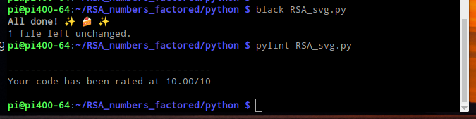
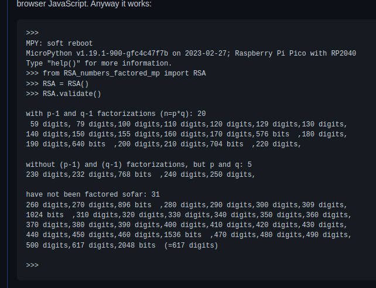
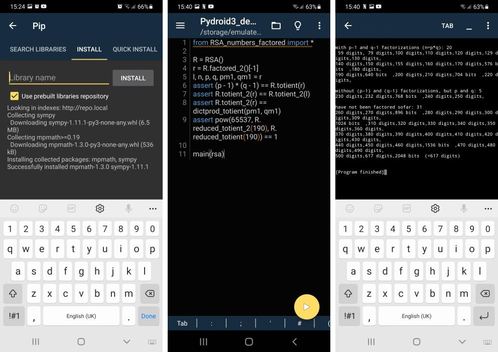

# RSA_numbers_factored.py

* [Introduction](#introduction)
  * [Python code formatting and linting](#python-code-formatting-and-linting)
  * [Makefile](#makefile)
* [RSA_numbers_factored.py documentation](#rsa_numbers_factoredpy-documentation)
* [Non-standard Python environments](#non-standard-python-environments)
  * [MicroPython](#micropython)
  * [Android](#android)
* Functionality validation:
  * [Python, browser and nodejs demos](../README.md#functionality-validation-python-browser-and-nodejs-demos)
  * [Python snapshot](../README.md#functionality-validation-python-snapshot)
* [Multiple precision integer performance across languages](../performance/README.md)

## Introduction 

Associated forum thread:  
[https://forums.raspberrypi.com/viewtopic.php?t=343468](https://forums.raspberrypi.com/viewtopic.php?t=343468)

Continuation of [RSA_numbers_factored.py gist](https://gist.github.com/Hermann-SW/839dfe6002810d404e3f0fe1808a6333) (now in [./RSA_numbers_factored.py](./RSA_numbers_factored.py)). Python code changes get manually transpiled to [../RSA_numbers_factored.js](../RSA_numbers_factored.js) for use in nodejs and HTML demos, find [details here](../README.md) (with added JavaScript implementation of sympy functions gcd and isprime, and functions from itertools).

### Python code formatting and linting

With v1.10 this repo is formatted with Python code formatter **black**, and **pylint**ed.  
Here shown for demo [RSA_svg.py](RSA_svg.py) to create SVG from a RSA number:  


Different to OpenSSL random art, the generated image exposes RSA number factor p (1-bits = shown rows) and factor q (1-bits = shown columns) with "and" function:  
```
    $ python RSA_svg.py 250 > 250.svg
    $ convert 250.svg 250.svg.png 
    $ file 250.svg.png 
    250.svg.png: PNG image data, 414 x 415, 2-bit colormap, non-interlaced
    $ 
```


### Makefile

Makefile targets:
```
    $ make
    targets: doc|doc_diff|pylint|black|validate|clean
    $
```

* <b>doc</b>: runs lazydocs to create new doc, with some sed replacements
* <b>doc_diff</b>: updates doc, and shows reduced version of ```git diff``` for doc
* <b>pylint</b>: runs pylint, allows long lines with 92+ continuous digits, ignores no-self-use and invalid-name warnings
* <b>black</b>: runs "black" Python formatter, followed from ```make validate```
* <b>validate</b>: compares validation run output against file "validate.good"
* <b>clean</b>: remove doc and temporary file
 
## RSA_numbers_factored.py documentation  

Generated with lazydocs, can be found here:  
[docs/RSA_numbers_factored.py.md](docs/RSA_numbers_factored.py.md)

Updated with ```make doc```.

## Non-standard Python environments

### MicroPython

Not up to date version with  emulation of used sympy functionality [RSA_numbers_factored_mp.py](RSA_numbers_factored_mp.py) does run on MicroPython on a 264KB ram only Raspberry Pico RP2040 microcontrolller (just for fun — "Validation demo takes 3:09min on RP2040 MicroPython, instead of 1 second in Python or browser JavaScript version though ..."). More details in [this forum posting](https://forums.raspberrypi.com/viewtopic.php?t=343468&start=25#p2085457)  


### Android

Unmodified RSA_numbers_factored.py works on Android (with [Pydroid3](https://play.google.com/store/search?q=Pydroid3) playstore app, 3 day free trial, 2$/month, 16$/lifetime) as well. Test \_\_name\_\_ == "\_\_main\_\_" does not work in Pydroid3, so new demo [Pydroid3_demo.py](Pydroid3_demo.py) added. Details in [this forum posting](https://forums.raspberrypi.com/viewtopic.php?t=343468&start=25#p2090124)  


