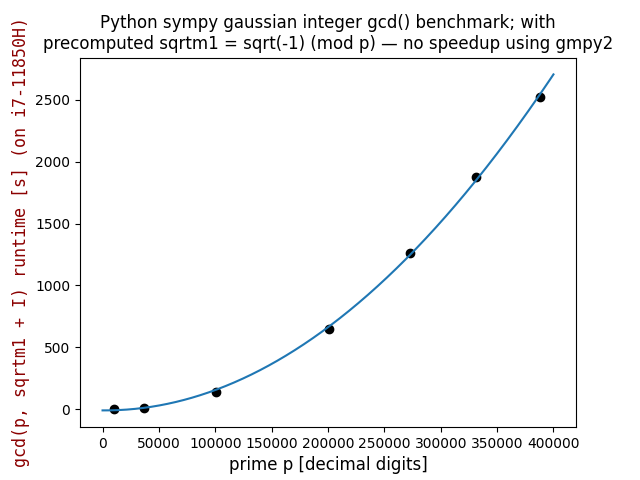

## Sympy gaussian integer gcd() benchmark

Tests done on Intel i7-11850H CPU, for primes ranging from 10000-digits up to 388342-digits.  
Same runtimes with and without using C-coded ```gmpy2``` module supporting multiple-precision arithmetic.  
gcd() computation verified by asserting known "sum of squares" property:  
```
...
t2 = gcd(p, sqrtm1 + I)
...
x, y = t2.as_real_imag()
assert x**2 + y**2 == p
```
| | | | | | | |
|-|-|-|-|-|-|-|
|[10000.py](10000.py)|[36401.py](36401.py)|[100355.py](100355.py)|[200700.py](200700.py)|[272770.py](272770.py)|[330855.py](330855.py)|[388342.py](388342.py)|

```gcd(p, sqrtm1 + I)``` runtimes (up to 42 minutes for 388342-digit prime) is quadratic in input size, so an efficient algorithm:  
[https://github.com/Hermann-SW/QuadraticRegression/blob/master/sympy_gaussian_integer_gcd_benchmark.py](https://github.com/Hermann-SW/QuadraticRegression/blob/master/sympy_gaussian_integer_gcd_benchmark.py)  

