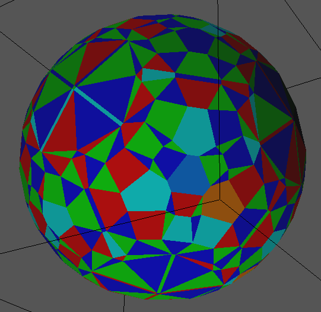

qhull from [qhull.org](qhull.org) needs to be installed, as well as [geomview](http://www.qhull.org/html/index.htm#geomview) and [PARI/GP](https://pari.math.u-bordeaux.fr/).

[square-free.gp](square-free.gp) is auxiliary GP script.

GP script [nbox.gp](nbox.gp) is qhull [rbox](http://www.qhull.org/html/rbox.htm) equivalent, creates sum of three squares polyhedron:   
```
pi@raspberrypi5:~/RSA_numbers_factored/qhull $ n=5 gp -q < nbox.gp 
3
24
-2 -1 0
-2 0 1
-2 0 -1
-2 1 0
...
2 0 -1
2 1 0
pi@raspberrypi5:~/RSA_numbers_factored/qhull $ 
```


Bash script [display](display) creates all integer x,y,z with n=p\*q=x^2+y^2+z^2.   
Then calls [qconvex](http://www.qhull.org/html/qconvex.htm) to create convex hull polyhedron.   
Finally displays with [geomview](http://www.qhull.org/html/index.htm#geomview).

Points on equator with all ± and permutations possible, postive:      
221=13\*17=11^2+10^2+0^2=14^2+5^2+0^2
```
$ ./display 13*17
```

See [GP demo](https://stamm-wilbrandt.de/en/#GPdemo) and following "long-term objective" on why equator of sum of three squares polyhedron are of interest to me ...


No edges needed if neighboring face colors different enough.   
[pq6col.cpp](pq6col.cpp) does 6-coloring of faces created by qconvex.   
Creates OFF file with edges turned off, and finally displays with geomview:   
```
$ ./pq6col 13 277
```

The 6 colors used are blue, green, red, cyan, orange and azure.   
13 and 227 are minimal arguments to make algorithm use 6 colors:      



[2graph.cpp](2graph.cpp) creates a LEDA graph instead, which can be processed by graph algorithms:
```
pi@raspberrypi5:~/RSA_numbers_factored/qhull $ ./2graph 5
LEDA.GRAPH
point3D
int
24
(-2,-1,0)
(-2,0,1)
(-2,0,-1)
...
(2,0,1)
(2,0,-1)
(2,1,0)
36
0 1 0
0 2 0
0 4 0
1 3 0
...
20 22 0
21 23 0
22 23 0
pi@raspberrypi5:~/RSA_numbers_factored/qhull $ 
```
